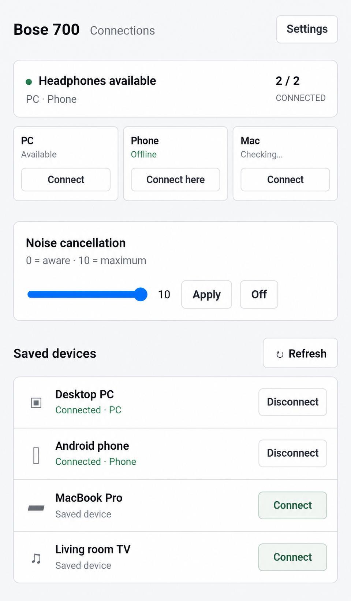
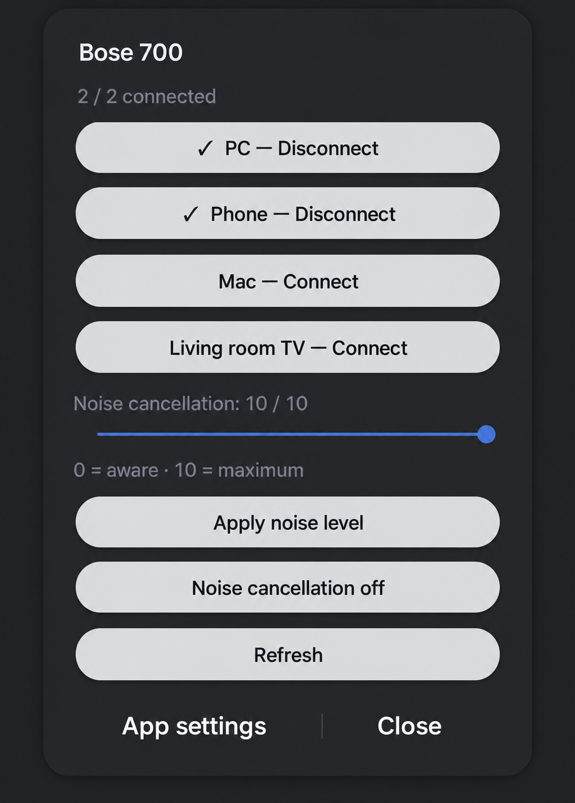
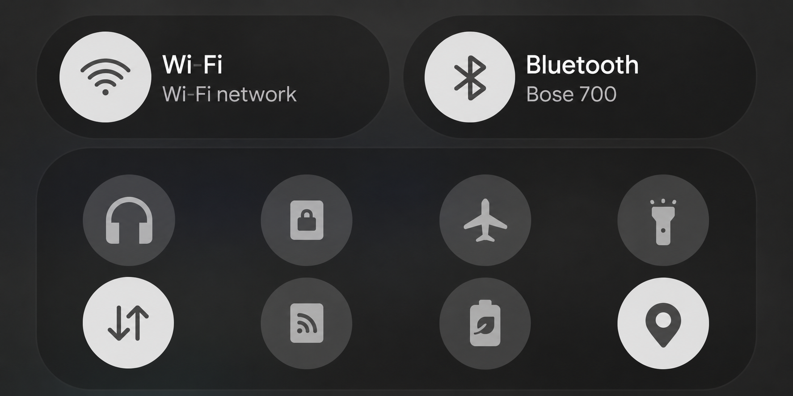

# Bose Connections

A minimal connection dashboard for the **Bose Noise Cancelling Headphones 700**.
See the headset's saved devices, connect or disconnect them, and choose which
connection to replace when both Bluetooth slots are occupied.

- Shared dashboard for Linux, macOS and Android.
- Noise cancellation levels 0–10 and Off, with verified headset state.
- Android Quick Settings tile with a compact connections and ANC panel.
- Native Mac menu-bar headphones icon and an Omarchy Linux top-bar popup.
- Optional authenticated controller-to-controller relay over Tailscale: an
  unconnected computer can send a request through a controller that reaches the headset.
- Immediate last-known device list, followed by a live refresh.
- Connection changes reread headset state, preserve a known control device, and
  verify the result. An ambiguous command is never retried through another peer.

## Screenshots

Device and network names are anonymized; unrelated phone content is removed.

<table>
  <tr><th>Android dashboard</th><th>Quick Settings controls</th></tr>
  <tr>
    <td></td>
    <td></td>
  </tr>
</table>

**Bose tile in Android Quick Settings** — the headphones icon at the upper left.



Independent community project; not affiliated with Bose. **Experimental:**
macOS reads and disconnect/reconnect have been verified on one NC700 running
firmware 1.8.2. Linux direct reads and phone disconnect/reconnect are also verified,
as are ANC levels 9 and 10. Relay switching has succeeded but repeated recovery
checks have been inconsistent. Android installs/builds and its Quick Settings tile
is registered, and its dialog appearance has been checked on Samsung Android.
Android direct Bluetooth and recovery behavior still need validation.
Sleep/reboot recovery and automatic controller retention remain experimental.
This does not support other Bose models.

Noise cancellation offers levels **0–10** and **Off**. Unknown packet layouts
refuse writes. Changes are read back from the headset; missing acknowledgements
trigger verification, never a blind repeat. Enabling ANC may reset the NC700 to
maximum, so a second write occurs only after a confirmed read of that transition.

## What is authoritative?

The headset owns saved devices and active connections. Each controller keeps a
private timestamped `snapshot.json` for display. Menus load that list immediately,
then query the headset directly or through a peer. Cached data never replaces the
fresh checks performed before/after a connection change.

Controller roles, peer addresses and the shared relay token live in each
controller's private `config.json`. **Role/settings edits are not synchronized.**
Provision the same role mappings and token on each controller. Live snapshots may
briefly differ between refreshes; this is not a distributed database or a promise
of continuous connectivity. If every controller loses headset access, reconnect
one through system Bluetooth settings or the Bose app.

## Desktop setup

Requires Python 3.12+; Linux direct access uses BlueZ/RFCOMM. On macOS, the
installer creates a private venv, installs the included MIT `pybmap` package and
PyObjC when needed, and builds a native application using Xcode Command Line Tools.
Pair your NC700 in system Bluetooth settings first. Obtain its Bluetooth address.

Create a **local-only** controller config (replace the example address):

```sh
python3 configure.py --id pc --headset AA:BB:CC:DD:EE:FF
python3 controller.py
```

Open `http://127.0.0.1:8847`. The config and cache are stored under
`~/.local/state/bose-control/`, outside the repository. Existing configs are not
overwritten by `configure.py`. The default NC700 RFCOMM channel is 8; it may need
verification on your headset/firmware.

For macOS, create a config with `--id mac`, then run:

```sh
python3 install_mac.py --config ~/.local/state/bose-control/config.json
```

This installs `~/Applications/Bose Connections.app` and a per-user LaunchAgent
`local.bose.connections`. The background helper adds a headphones icon to the menu
bar; open the app for the full dashboard. Allow Bluetooth when macOS asks.
IOBluetooth calls run on the Python main thread under the native app for proper
privacy attribution. Running the backend directly through SSH is not equivalent.

### Optional Tailscale relay

Use each controller's actual Tailscale IPv4 address. The addresses below are **illustrative placeholders**, not real device addresses.
Replace every headset, adapter and Tailscale address with your own:

```sh
python3 configure.py --id pc --headset AA:BB:CC:DD:EE:FF \
  --bind 100.64.0.1 --peer mac=100.64.0.2 --peer phone=100.64.0.3 \
  --role pc=11:22:33:44:55:66 --role mac=22:33:44:55:66:77 \
  --role phone=33:44:55:66:77:88
```

The first config generates a random token without printing it. Transfer a copy
privately to another machine and use `--token-from /private/path/config.json` when
creating that machine's config; swap its ID, bind address and peer list. Keep all
configs private. Do not put them in this repo. Settings can identify controller
roles from the headset's saved-device list.

Dashboard: loopback port **8847**, with Host/Origin checks. Mesh: configured
Tailscale IPv4 port **8848**, tailnet source checks and shared bearer token.
HTTP is used inside Tailscale's encrypted network; there is no public server or
cloud API. Do not expose these listeners through public port forwarding.

### Linux top-bar popup (Omarchy)

The widget uses Omarchy's Quickshell plugin system. Start the Python helper at
login using your preferred user service, then copy `linux/` to
`~/.config/omarchy/plugins/local.bose/`. Validate and enable it:

```sh
omarchy plugin validate ~/.config/omarchy/plugins/local.bose
omarchy plugin enable local.bose right
```

Back up your shell config before layout changes. Click the headphones icon to
select a device. Connected devices have checkmarks; when both slots are occupied,
select which device to disconnect. The same backend protections apply to menu and
dashboard actions. Other Linux desktops can use the web dashboard; a generic
system-tray implementation is not included.

On Linux, preparing a connection briefly enables BlueZ discovery for up to 30
seconds and restores the previous setting, allowing incoming connections to a
powered but non-connectable adapter. Status checks do not dial disconnected PC/Mac
hosts. Actions select the first eligible controller and always check actual headset
state before changing connections. Linux requires the `busctl` utility (systemd);
`adapter` in private config defaults to `hci0` for the paired headset.

## Android

Requires Android 8+; build target is Android 15 (API 35). Install JDK 17+ and the
Android SDK platform 35/build-tools. Set `ANDROID_HOME`, then run:

```sh
python3 build_android.py
adb install -r dist/bose-connections.apk
```

This builds a personally signed, debuggable APK. Signing material stays in your
private state directory; preserve it for compatible updates. No credentials or
headset address are embedded in the APK. No prebuilt APK release is published yet.

Open **Bose Connections** and allow Nearby devices and notifications. In Settings
→ Set up controller links, enter the paired headset's Bluetooth address. For relay,
enter the private token and PC/Mac Tailscale addresses; those fields may be left
empty for phone-only Bluetooth access.

Alternatively, create a private config with `configure.py --id phone` and
provision it into the installed app's `files/config.json` using Android `run-as`.
The app's foreground service listens on its detected Tailscale interface while
running and retains a notification. No boot receiver is installed. VPN rebinding,
screen-off behavior and direct Bluetooth control remain experimental.

### Android Quick Settings

Add **Bose** using the Quick Settings panel's edit button after installation. Tap
the tile for a compact device list, connect/disconnect and explicit slot replacement,
plus ANC level and Off controls. It uses the same private config and cached state
as the app; cached entries display immediately, and mutations require live state.
A locked phone must be unlocked before controls open. Long-press opens app settings.

## Development

```sh
python3 -m unittest discover -s tests -v
```

The 28 protocol/controller tests use simulated transports and have no hardware
side effects. They cover packet fragmentation, rejected commands, slot/anchor
protection, mutation verification, ambiguous-command handling and private cache
persistence, ANC handling and avoiding competing background connections. CI runs them on Python 3.12 and 3.13.

For GUI checks, start the local helper, install Node dependencies (`npm install`)
and Chromium, then run `npm run test:gui`. Set `CHROMIUM_PATH` or `BOSE_URL` if
needed. The runner intercepts API responses with synthetic data and verifies
mobile/desktop layouts, settings and the replacement dialog. It creates ignored
screenshots under `artifacts/`; it sends no connection mutations.

## Remove

- Linux: stop your helper service; disable/remove the `local.bose` plugin.
- Mac: unload/remove `~/Library/LaunchAgents/local.bose.connections.plist` and
  remove `~/Applications/Bose Connections.app`.
- Android: stop the relay in controller-link settings or uninstall the app.

Retain private configuration/signing files if reinstalling. The controller does
not delete pairings or update firmware. ANC settings change only on explicit actions.

## License and credits

GPL-3.0; see [LICENSE](LICENSE). BMAP protocol references and the vendored MIT Mac
transport are credited in [THIRD_PARTY.md](THIRD_PARTY.md), with revisions in
[upstream-revisions.json](upstream-revisions.json).
